# AAA Hosting Services

Welcome to the AAA Hosting Services project!

## Project Description

This project is built using Liferay DXP (Digital Experience Platform). We've developed a rich and user-centric design for our website, allowing users to subscribe to various hosting services.

## Project Links

- [Liferay DXP Documentation](https://liferay.dev/)
- [Liferay Digital Experience Platform](https://www.liferay.com/resources/l/digital-experience-platform)

## Project Screenshots

Below are the screenshots of our project. You can find these images in the "Images/" directory within this repository.

1. **About**
   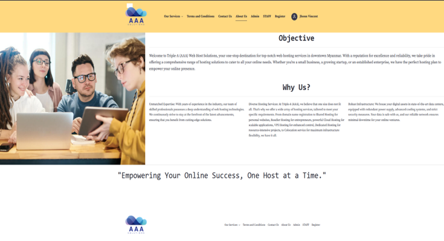

2. **CHS (Hosting Services)**
   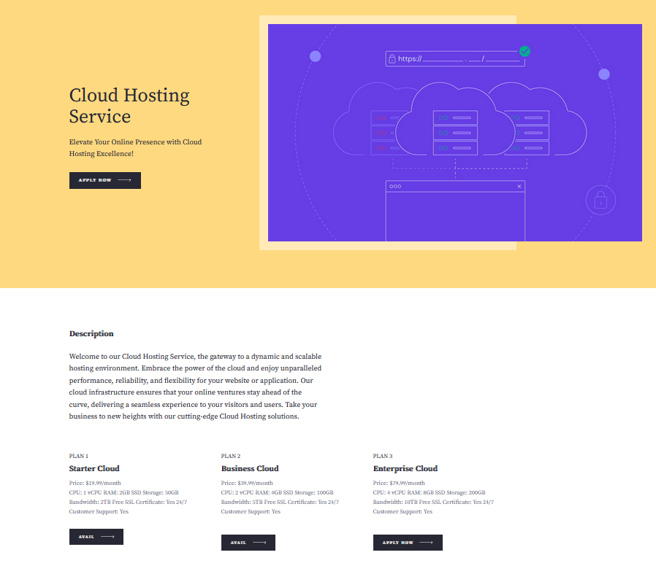

3. **Contact Us**
   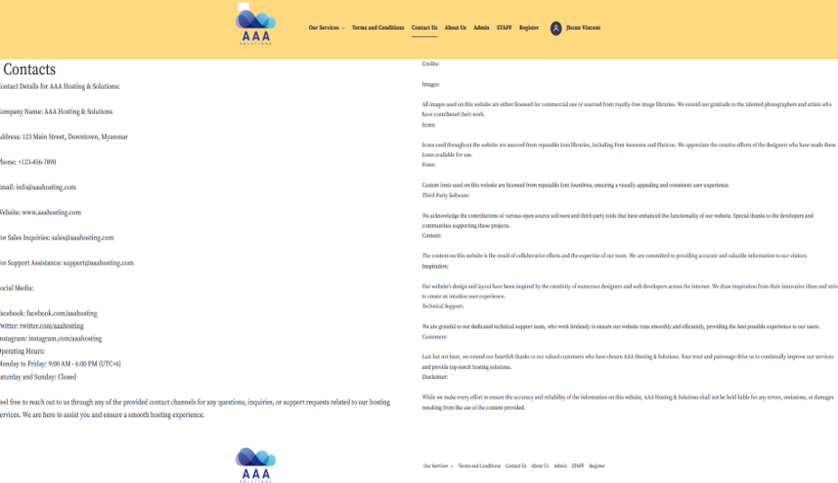

4. **Customer Support (CS)**
   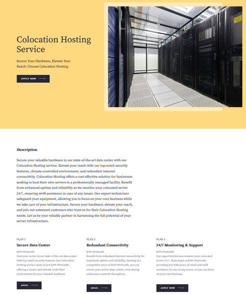

5. **DHS (Hosting Services)**
   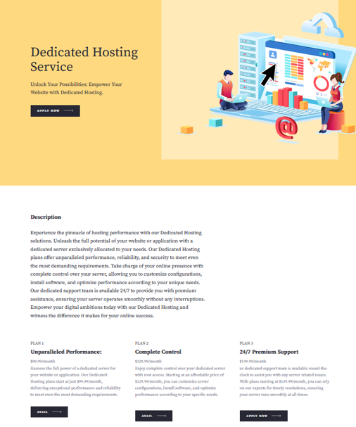

6. **DNS (Domain Services)**
   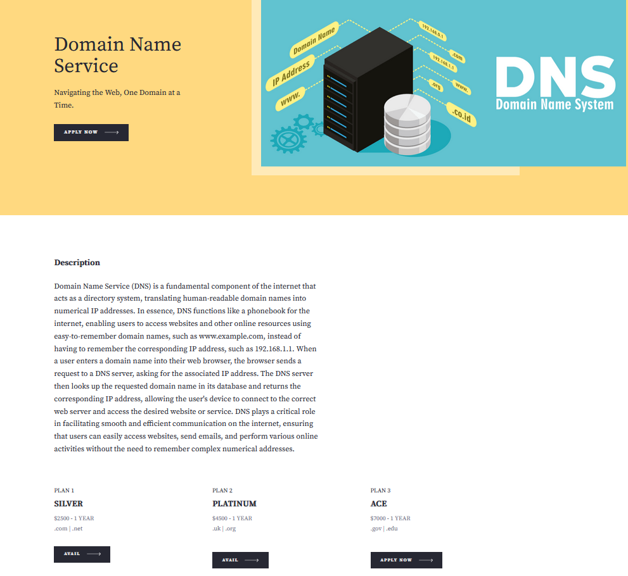

7. **Home Page**
   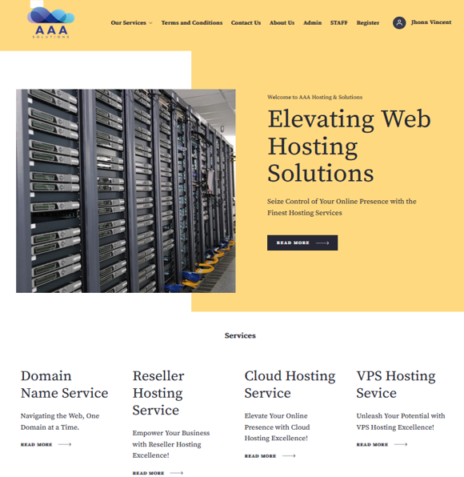

8. **Login Page**
   

9. **Register Page**
   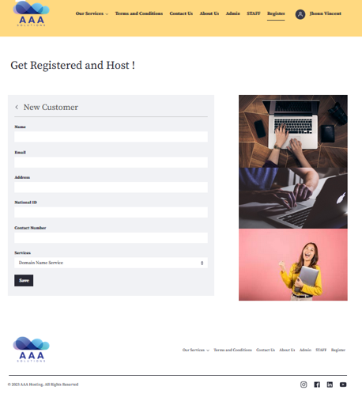

10. **RHS (Hosting Services)**
    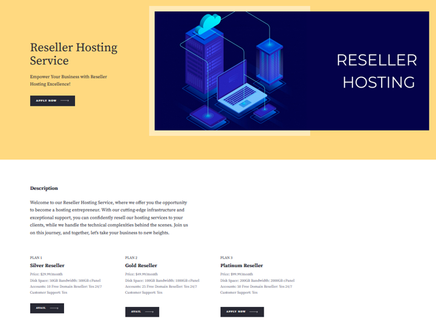

11. **Services Page**
    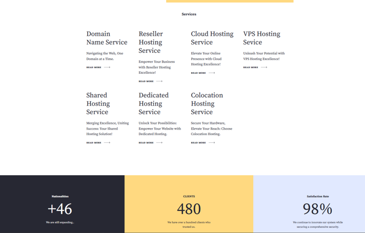

12. **SHS (Hosting Services)**
    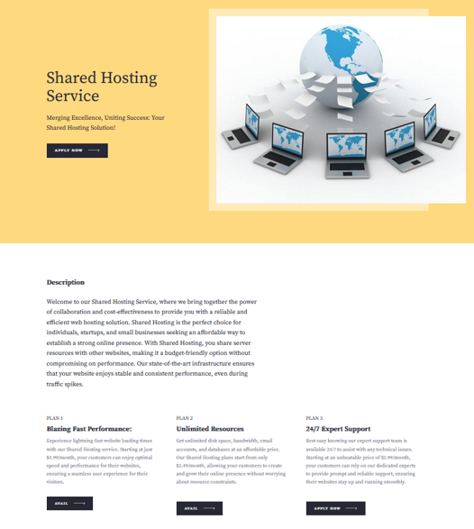

13. **Terms and Conditions**
    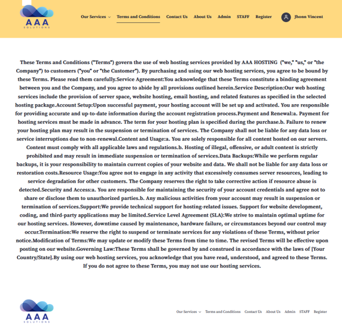

14. **VHS (Hosting Services)**
    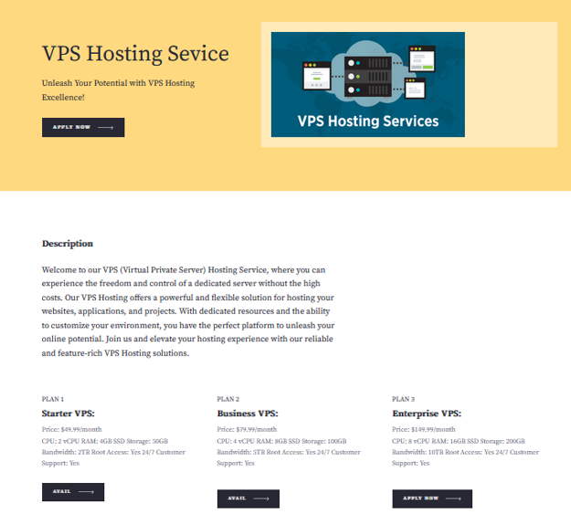

Feel free to explore the project and its various components. If you have any questions or would like to contribute, please don't hesitate to get in touch with me!

Thank you for your interest in AAA Hosting Services.
